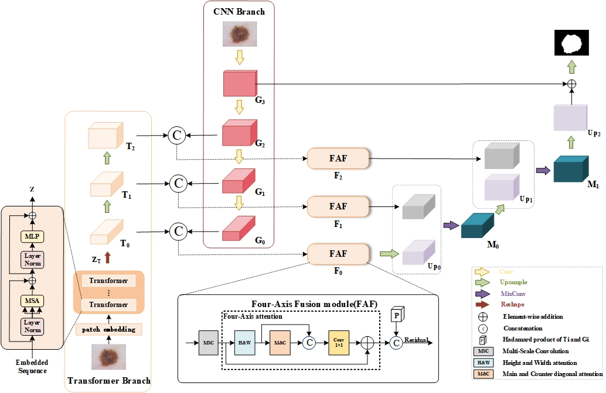

# FAFuse
This repo holds the code of FAFuse: A Four-Axis Fusion framework of CNN and Transformer for Medical Image Segmentation for Medical Image Segmentation

## Requirements
* Pytorch>=1.6.0, <1.9.0 (>=1.1.0 should work but not tested)
* timm==0.3.2

## Model Overview

      

## Experiments

### ISIC2018 Skin Lesion Segmentation Challenge
GPUs of memory>=12G shall be sufficient for this experiment. 

1. Preparing necessary data:
	+ downloading ISIC2018 training, validation and testing data from the [official site](https://challenge.isic-archive.com/data/#2018), put the unzipped data in `./data`.
	+ run `random_division.py` to randomly divide the number of datasets
	+ run `process.py` to preprocess all the data, which generates `data_{train, val, test}.npy` and `mask_{train, val, test}.npy`.
	+ alternatively, the processed data is provided in [Baidu Pan, pw:cczu](https://pan.baidu.com/s/12oH_yxcW15yHUYm2l9nWVQ) .

2. Testing:
	+ downloading our trained FAFuse-B from [Baidu Pan, pw:cczu](https://pan.baidu.com/s/1LSOAsciZLTSkMGzu_plS8g)  to `./snapshots/`.
	+ run `test_isic.py --ckpt_path='snapshots/FAFuse-18_.pth'`.

3. Training:
	+ downloading DeiT-base from [DeiT repo](https://github.com/facebookresearch/deit) to `./pretrained`.
	+ downloading resnet-34 from [timm Pytorch](https://github.com/rwightman/pytorch-image-models/releases/download/v0.1-weights/resnet34-43635321.pth) to `./pretrained`.
	+ run `train_isic.py`; you may also want to change the default saving path or other hparams as well.

## Reference
Some of the codes in this repo are borrowed from:
* [Facebook DeiT](https://github.com/facebookresearch/deit)
* [timm repo](https://github.com/rwightman/pytorch-image-models)
* [Transfuse](https://github.com/Rayicer/TransFuse)

## datasets
* downloading kvasir from [Baidu Pan, pw:cczu](https://pan.baidu.com/s/1WyGNXZdqWJtYhwPzpqd2qQ)
* downloading CVC-ClinicDB from [Baidu Pan, pw:cczu](https://pan.baidu.com/s/1RXhYeRW96UkoP3oHdTC6kw)

## Questions
Please drop an email to yuanbaohua@cczu.edu.cn

